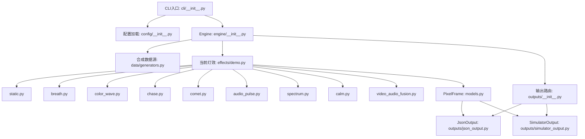
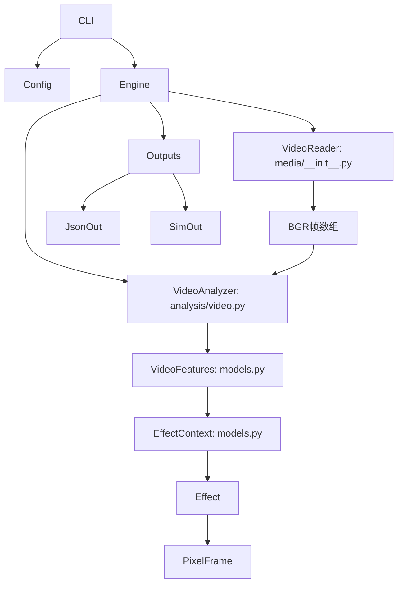
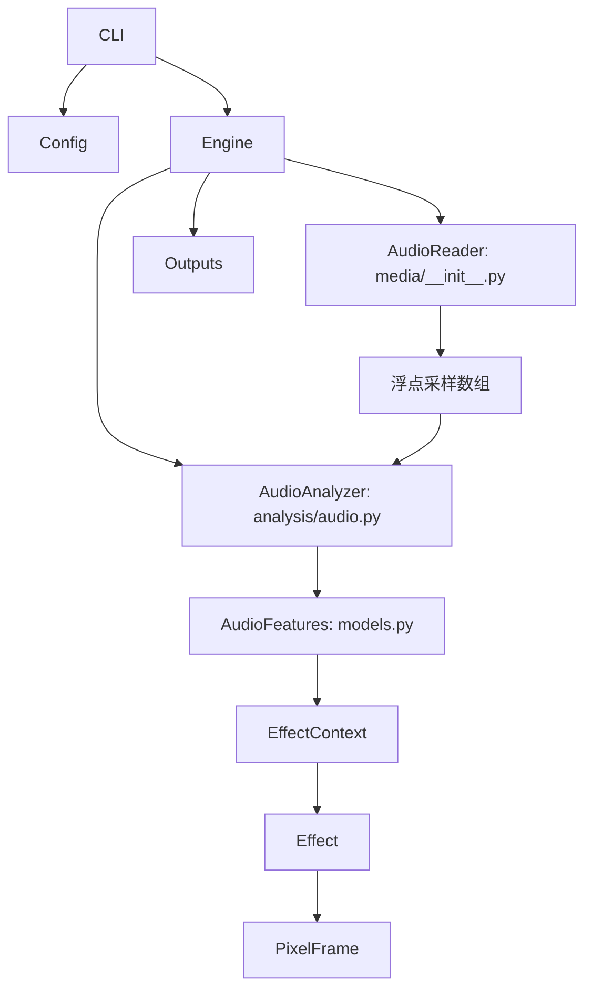
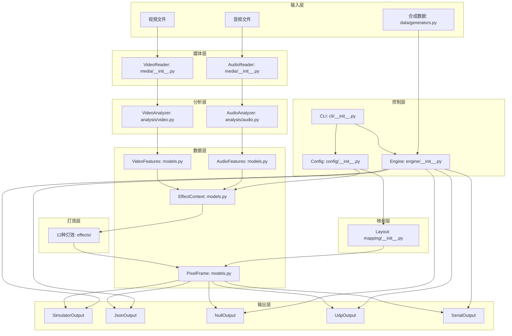

# 程序调用关系图

## 当前DEMO实际经过的模块

## 视频模式实际经过的模块

## 音频模式实际经过的模块

## 目前不会在默认DEMO中运行的模块

| 模块 | 原因 |
|------|------|
| `outputs/udp_output.py` (UDP) | 需ESP32-S3硬件 |
| `outputs/serial_output.py` (串口) | 需STM32硬件 |
| `clock.py` (时钟系统) | 当前未集成到Engine |
| `pipeline.py` (队列架构) | 当前未集成 |

## 只有真实硬件接入后才有作用的模块

| 模块 | 需要什么硬件 |
|------|-------------|
| `UdpOutput` | ESP32-S3 + Wi-Fi + WS2812B数字灯带 |
| `SerialOutput` | STM32F103C8T6 + RS-485 + RGBW COB灯带 |

## 完整模块调用关系

